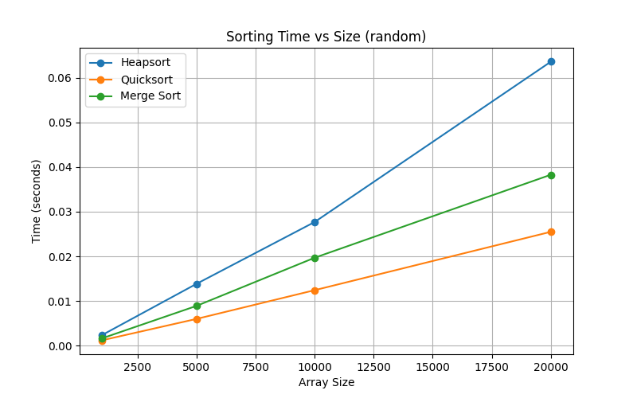
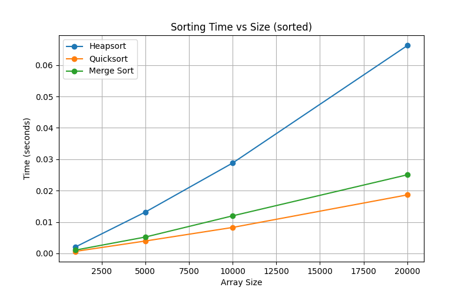
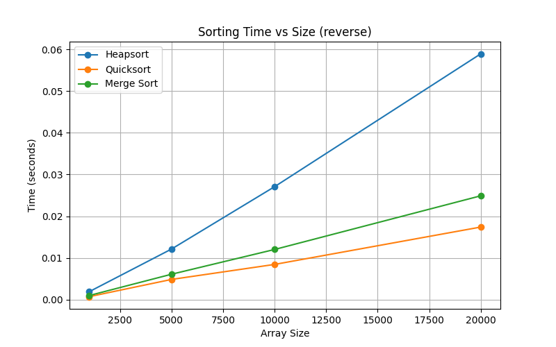

<h1 align="center" style="color:#2d6cdf;">Heap Data Structures: Implementation, Analysis, and Applications</h1>

  
  
  

  
  
  

---

## 📋 Table of Contents
- [📝 Overview](#-overview)
- [📊 Empirical Analysis](#-empirical-analysis)
- [🚀 How to Run](#-how-to-run)
- [📈 Results & Visualizations](#-results--visualizations)
- [📁 Project Structure](#-project-structure)
- [🪪 License](#-license)

---

## 📝 Overview
This repository contains original Python implementations for:
- <b>Heapsort</b>
- <b>Priority Queue using a Binary Heap</b>
- Automated empirical analysis and visualizations comparing Heapsort, Quicksort, and Merge Sort.

---

## 📊 Empirical Analysis

Automated analysis is performed using generator functions. When you run <code>heapsort.py</code>, it produces timing statistics and saves plots for different input distributions:

  
  
  

---

## 🚀 How to Run

1. <b>Install dependencies:</b>
   <pre style="background:#f4faff; color:#2d6cdf;"><code>pip3 install matplotlib numpy</code></pre>
2. <b>Run the analysis:</b>
   <pre style="background:#f4faff; color:#2d6cdf;"><code>python3 main.py</code></pre>
3. <b>View the generated images</b> in your project directory and review the printed timing statistics.

---

## 📈 Results & Visualizations

#### Example Timing Results

<pre style="background:#f4faff; color:#2d6cdf;">
Heapsort | size=1000 | random: 0.0024 sec
Quicksort | size=1000 | random: 0.0012 sec
Merge Sort | size=1000 | random: 0.0016 sec
...
Saved plot: analysis_random.png
Saved plot: analysis_sorted.png
Saved plot: analysis_reverse.png
</pre>

- <b>Heapsort</b> is consistent across distributions.
- <b>Quicksort</b> is fastest on sorted data, but can be slower on reverse or random.
- <b>Merge Sort</b> is stable and fast, but uses more memory.

---

## 📁 Project Structure

<pre style="background:#f4faff; color:#2d6cdf;">
analysis_random.png        # Random array timing plot
analysis_sorted.png        # Sorted array timing plot
analysis_reverse.png       # Reverse array timing plot
analysis_report.md         # Detailed report and discussion
assignment.txt             # Assignment instructions
heapsort.py                # Heapsort and analysis code
priority_queue.py          # Priority queue implementation
README.md                  # This file
</pre>

---

## 🪪 License

This project is licensed under the MIT License. See the <a href="LICENSE">LICENSE</a> file for details.

---
